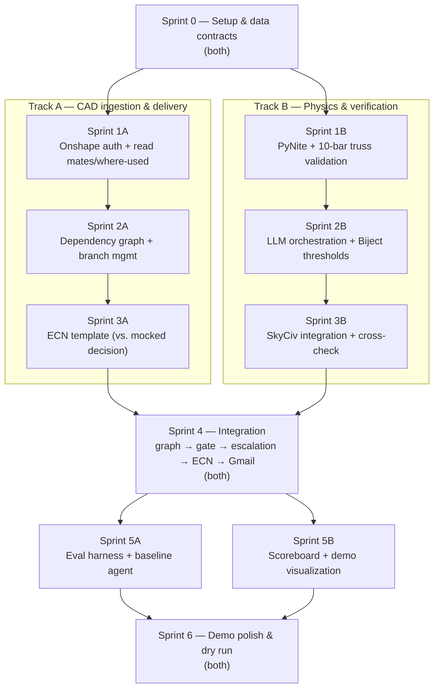

# EARL — Sprint Timeline

No dates — sprints are just units of work, sized to keep two people busy in parallel as much as the pipeline's dependencies allow. Work splits into two tracks:

- **Track A — CAD ingestion & delivery**: Onshape graph reading, branch management, ECN generation, Gmail delivery.
- **Track B — Physics & verification**: PyNite solver, Biject threshold logic, SkyCiv integration, cross-checking.

The two tracks only need to sync at three points: agreeing the data contracts up front (Sprint 0), wiring the two halves together once both exist (Sprint 4), and the final rehearsal (Sprint 6). Everything else can run independently.

## Sprints

### Sprint 0 — Setup & data contracts (both)
- Repo scaffolding, venv, API credentials for Onshape / SkyCiv / Gmail
- Agree the shared schemas *before* splitting up, so neither track blocks on the other later:
  - the **dependency graph** shape Track A hands to Track B (nodes, members, edges downstream of a change)
  - the **decision object** shape Track B hands to Track A (per-member before/after stress, safety factor, approved/escalated, SkyCiv report ref)

### Sprint 1
| Track A | Track B |
|---|---|
| Onshape API auth; read variable table edits and feature changes; pull mate structure + "where used" refs | Stand up PyNite; validate against the 10-bar truss benchmark (Haftka & Gürdal / Rajan) against published stress/displacement values |

### Sprint 2
| Track A | Track B |
|---|---|
| Build the dependency graph walker (every member/node downstream of a change); Onshape branch create/evaluate/reset/merge | LLM orchestration for stage 2 (change → load case → model setup); Biject threshold module enforcing the safety-factor cutoff in code |

### Sprint 3
| Track A | Track B |
|---|---|
| ECN template — agent-generated from the decision-object schema, built and tested against **mocked** decision output so it doesn't block on Track B | SkyCiv API integration (trigger analysis, pull the report, AISC-style design checks); cross-check comparison logic (PyNite vs. SkyCiv agreement/disagreement) |

### Sprint 4 — Integration (both) — done
Wire the two tracks together end to end: dependency graph → fast gate → Biject decision → (escalated) SkyCiv report → ECN → Gmail delivery. This is where Track A's graph output first meets Track B's real decision object instead of the mock.

Delivered as `earl/pipeline.py` (`run_pipeline`), `earl/delivery/gmail.py`, contract 0.2.0 (`Material.allowable_stress`, `Decision.source`, `MemberResult.hops_from_change`/`reached_via`) and `scripts/run_pipeline.py`. The one real fit problem — the two tracks' graph builders disagreeing 2x on member capacity — is recorded and resolved in `Plan/sprint3a_handover.md`.

### Sprint 5
| Track A | Track B |
|---|---|
| Eval harness — ~20 scenarios from parametrically perturbing the validated truss; baseline LLM+PyNite-only agent (no graph traversal, no enforced thresholds) for comparison | Dropped-dominoes scoreboard (baseline vs. system) and demo visualization of the truss with per-member state |

### Sprint 6 — Demo polish & dry run (both)
Run the full demo flow end to end, tighten the escalation example, rehearse the close on the scoreboard number.

## Diagram

