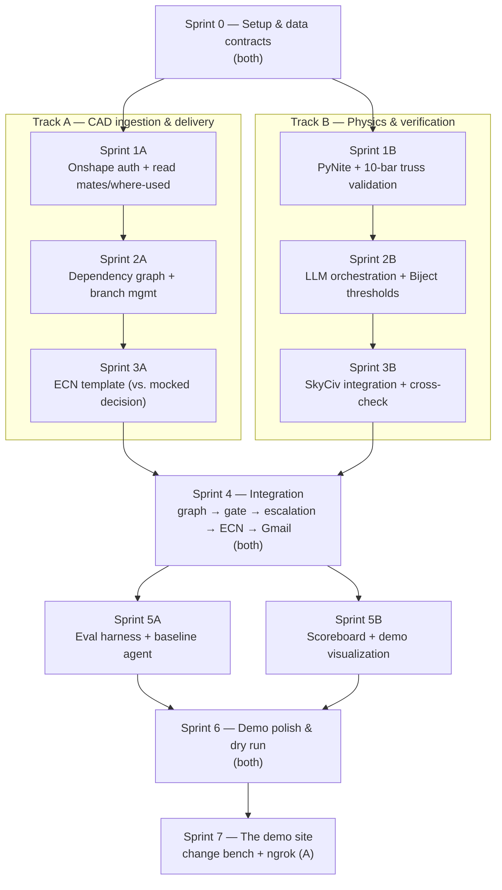

# EARL — Sprint Timeline

No dates — sprints are just units of work, sized to keep two people busy in parallel as much as the pipeline's dependencies allow. Work splits into two tracks:

- **Track A — CAD ingestion & delivery**: Onshape graph reading, branch management, ECN generation, Gmail delivery.
- **Track B — Physics & verification**: PyNite solver, Biject threshold logic, SkyCiv integration, cross-checking.

The two tracks only need to sync at three points: agreeing the data contracts up front (Sprint 0), wiring the two halves together once both exist (Sprint 4), and the final rehearsal (Sprint 6). Everything else can run independently.

## Sprints

### Sprint 0 — Setup & data contracts (both)
- Repo scaffolding, venv, API credentials for Onshape / SkyCiv / Gmail
- Agree the shared schemas *before* splitting up, so neither track blocks on the other later:
  - the **dependency graph** shape Track A hands to Track B (nodes, members, edges downstream of a change)
  - the **decision object** shape Track B hands to Track A (per-member before/after stress, safety factor, approved/escalated, SkyCiv report ref)

### Sprint 1
| Track A | Track B |
|---|---|
| Onshape API auth; read variable table edits and feature changes; pull mate structure + "where used" refs | Stand up PyNite; validate against the 10-bar truss benchmark (Haftka & Gürdal / Rajan) against published stress/displacement values |

### Sprint 2
| Track A | Track B |
|---|---|
| Build the dependency graph walker (every member/node downstream of a change); Onshape branch create/evaluate/reset/merge | LLM orchestration for stage 2 (change → load case → model setup); Biject threshold module enforcing the safety-factor cutoff in code |

### Sprint 3
| Track A | Track B |
|---|---|
| ECN template — agent-generated from the decision-object schema, built and tested against **mocked** decision output so it doesn't block on Track B | SkyCiv API integration (trigger analysis, pull the report, AISC-style design checks); cross-check comparison logic (PyNite vs. SkyCiv agreement/disagreement) |

### Sprint 4 — Integration (both) — done
Wire the two tracks together end to end: dependency graph → fast gate → Biject decision → (escalated) SkyCiv report → ECN → Gmail delivery. This is where Track A's graph output first meets Track B's real decision object instead of the mock.

Delivered as `earl/pipeline.py` (`run_pipeline`), `earl/delivery/gmail.py`, contract 0.2.0 (`Material.allowable_stress`, `Decision.source`, `MemberResult.hops_from_change`/`reached_via`) and `scripts/run_pipeline.py`. The one real fit problem — the two tracks' graph builders disagreeing 2x on member capacity — is recorded and resolved in `Plan/sprint3a_handover.md`.

### Sprint 5
| Track A | Track B |
|---|---|
| Eval harness — ~20 scenarios from parametrically perturbing the validated truss; baseline LLM+PyNite-only agent (no graph traversal, no enforced thresholds) for comparison | Dropped-dominoes scoreboard (baseline vs. system) and demo visualization of the truss with per-member state |

**Track B was already done before this sprint started.** `earl/analysis/scoreboard.py`
and `earl/analysis/visualize.py` shipped in `0a801d4` (the Sprint 1B–3B merge)
and the SVG is wired into `earl/pipeline.py`. Sprint 5 was therefore Track A
alone, building to a finished interface rather than a parallel one.

**Sprint 5A — done, with a finding that matters for the demo.** `earl/eval/`
(scenarios, agents, tools, llm, baseline, harness) plus `scripts/run_eval.py`;
100 new tests, 747 passing. Twenty scenarios across all five change kinds,
11 unsafe / 9 safe by the validated solver, with the failing member different
from the edited one in 10 of the 11. Everything runs on Meta Muse, baseline
included.

First full live run, both agents:

| agent | scenarios | unsafe members | caught | dropped dominoes | false alarms |
|---|---:|---:|---:|---:|---:|
| system | 20 | 22 | 22 | 0 | 0 |
| baseline | 20 | 22 | 22 | 0 | 0 |

**The baseline tied the system.** One `solve_load_case` call returns all ten
members' stresses, so on a structure this small there is nothing for a
dependency walk to find that brute force does not — the traversal advantage is
real in principle but is not demonstrated by this experiment. The system's
determinism, its code-enforced threshold and its paper trail are unaffected
and still hold. Full write-up, including the three axes on which a real gap
might still exist, in `earl/eval/README.md`. **This needs a decision before
Sprint 6 fixes the demo narrative in place.**

### Sprint 6 — Demo polish & dry run (both) — done
Run the full demo flow end to end, tighten the escalation example, rehearse the close on the scoreboard number.

`scripts/demo.py` runs the whole thing in six acts from one command, offline,
in about four minutes (`--pause` between acts, `--act N` for one). It reads the
recorded Sprint 5A run from `demo/recordings/`, which is committed precisely
because `artifacts/` is gitignored and the demo must survive a clean clone, a
rotated key or no network.

**The narrative changed, because the measurement did.** plan.md's flow opened
on a baseline LLM missing a domino. We measured both halves of that claim —
20 scenarios, then 3 repeats each — and the baseline missed nothing (22/22)
and never wavered (60/60). So the demo no longer claims a gap that is not
there. Act 4 is the new centre: a `Decision` with m5 at SF 0.735 flipped to
APPROVED goes into `validate()` and comes out a `ValueError`, on stage. The
close is *"we spent a sprint trying to prove a model would miss something;
over 60 runs it did not — it is still not the thing that decides whether the
change ships."*

**Two things the dry run caught that the test suite could not:**

- **SkyCiv had never worked live.** Every truss graph was rejected with 110
  validation errors (`sections[N]/Iy should be > 0`) because a truss section
  carries area only. Fixed in `skyciv_client.section_inertias()`. The model
  now validates and reaches the solver — where it stops on the free tier's
  **5-member cap** (the truss has 10). That is a purchasing decision, not a
  bug; the ECN and Act 6 both say so rather than citing a report nobody can
  open.
- **Gmail credentials are empty**, so `--send` raises. The demo uses the
  outbox `.eml`, which is byte-for-byte what Gmail would receive.

760 tests pass.

### Sprint 7 — The demo site (Track A) — done

Not in the original plan. Added because the pitch deck and a terminal are
worse than letting a judge break the thing themselves, and because the
deployment story was "ngrok" with nothing to tunnel.

`earl/web/` (`api.py`, `app.py`, `static/`) plus `scripts/serve.py`:

    python3 scripts/serve.py --ngrok

A change bench where anyone can resize a member, delete one, add or move a
load, or edit a variable, and watch the walk, the solve, the verdict, the
truss and the change notice come back. **Act 4 is a button** — "Approve it
anyway" takes the Decision that run produced, sets APPROVED, calls
`validate()` and prints the `ValueError`. A third tab carries the Sprint 5A
scoreboard, tie included.

Two decisions worth recording:

- **Every change is built by `earl.eval.scenarios`** — the module that builds
  the twenty eval scenarios — and run through `pipeline.run_pipeline`. A
  judge is driving the tested thing, not a demo-only imitation of it.
- **The threshold floor is not re-implemented in the web layer.** A request
  that tries to lower it reaches `gate.resolve_threshold` and is refused
  there. A rule enforced in two places is a rule that can disagree with
  itself, and this is the rule the whole project rests on.

`http.server`, no fourth dependency. The public-URL threat model and what the
server therefore refuses to do are in `earl/web/README.md`; 41 new tests
(801 total) cover it, including nine spellings of `../.env` on a raw socket.

## Diagram

