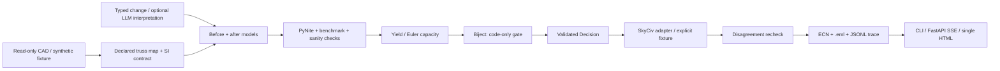

[Live Demo](https://unbridle-dining-crystal.ngrok-free.dev) | [Submission Branch: astra](https://github.com/Akhatri98/maah_earl/tree/astra)

`astra` is the working branch for this submission and the source of the deployment.

# EARL

EARL is CI for parametric CAD: structural regression tests with an enforced
gate and a paper trail. An engineer changes a truss; EARL re-solves it,
compares safety factors in code, holds failed changes in EARL, and writes
an Engineering Change Notice for the responsible human. Its contribution is
enforcement, notification, and record, not better physics.

## What Already Exists

[Onshape Simulation](https://www.onshape.com/en/features/simulation) already
provides cloud-native linear static FEA inside assemblies: stress,
displacement, factors of safety, automatically refreshed results, and versioned
simulations. [SkyCiv](https://skyciv.com/api/) already provides structural
analysis and reporting. EARL adds its numerical acceptance gate,
notification policy, and per-change decision record on top; no Onshape merge
or write capability is implemented.

## Try It

Open the live demo, choose **Thin m8: 8 in^2**, and click **Run structural
check**. The member becomes thinner, the pipeline streams its work, and Biject
escalates at **SF 0.478**, below the hard floor of 1.0. The ECN, email preview,
and raw trace are real generated artifacts. **Reinforce m1: 22 in^2** approves.

The public URL is a temporary ngrok tunnel. Its first-visit notice has a
**Visit Site** button; the dev machine must stay awake. Public requests cannot
call live APIs or send mail. The entire application also runs locally offline.

## Run Locally

```sh
python3.12 -m venv .venv
source .venv/bin/activate
pip install -r requirements.txt
python -m uvicorn earl.web:app --host 127.0.0.1 --port 8000
```

Open [localhost:8000](http://127.0.0.1:8000). No keys, JavaScript dependencies,
frontend build, or CAD account are required.

## Architecture



The model can interpret an edit, select a load case, and draft neutral prose.
It has **no merge, write, or send tool**; [the capability test](tests/test_capabilities.py)
asserts that boundary. `Decision.validate()` rejects approval below the floor
on both serialization and consumption. A solver failure is **ERROR**, not a
safety finding. No actual Onshape branch permission or merge is implemented.

## Evidence

Twenty fixed perturbations produce 18 member-failure findings. **EARL drops 0;
the rule-based selection baseline drops 10.** Both use the same validated
solver; the baseline chooses its verification scope before seeing results and
may choose all members. This measures omitted findings, not unsafe releases
or general LLM performance. [Committed results](earl/eval/cache/results.json)
power the scoreboard without a live evaluation.

```sh
python -m unittest discover -s tests -q
python -m earl eval
python -m earl run --scenario thin-compression
```

The CLI exits 0 for approval, 2 for escalation, and 1 for error, and always
attempts to write deliverables under `out/`. The current suite has 119 offline
tests, including the original 50. The [two-minute script](DEMO.md) gives exact
demo clicks. [RELIABILITY.md](RELIABILITY.md) records benchmark numbers,
baseline protocol, assumptions, and deployment verification.

## What Is Not Live

CAD geometry is the declared synthetic ten-bar fixture; the recorded live
Onshape document was empty. The offline SkyCiv attachment is a genuine public
example report of **a different model**, not an authenticated truss solve;
the UI explicitly says the independent cross-check was **NOT PERFORMED**.
Gmail is off and the saved `.eml` is the deliverable. Analysis is linear,
axial-only, and not AISC/ASCE code-compliant design.

[Dockerfile](Dockerfile) and [Render configuration](render.yaml) are provided,
with Render explicitly selecting `astra`. The verified public deployment is
the temporary tunnel, not Render; see the reliability record for restart
instructions and deployment limitations.
